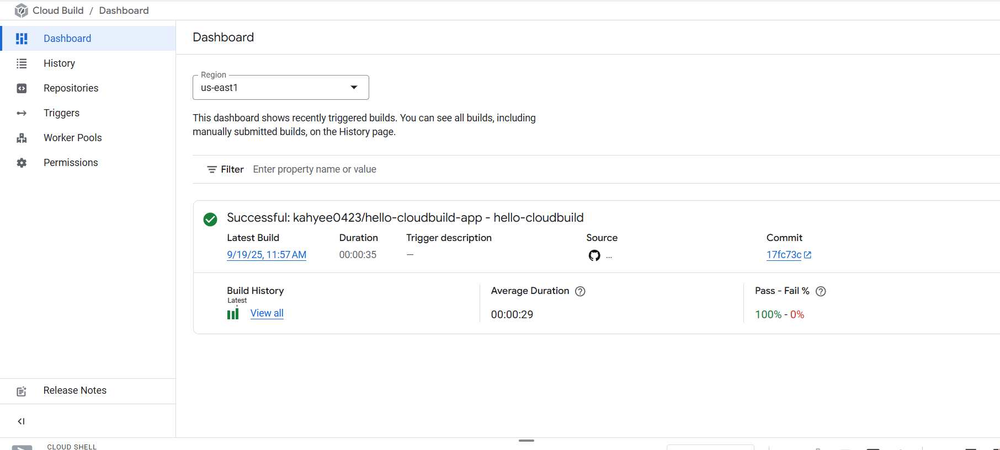
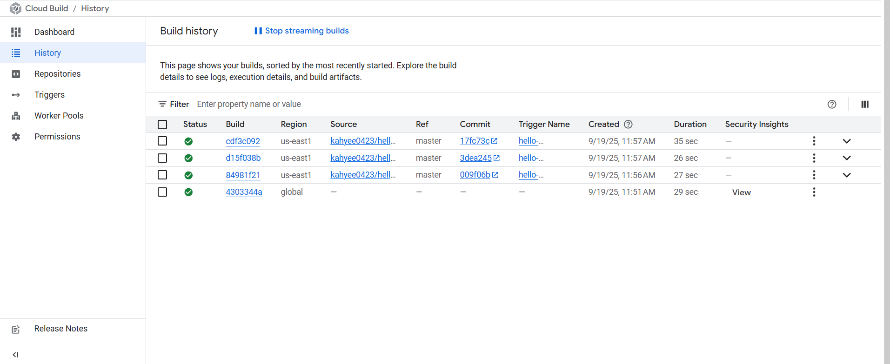

# GitOps-style Continuous Delivery For Kubernetes Engine With Cloud Build

GitOps is a Continuous Delivery approach [first described by Weaveworks](https://www.weave.works/blog/gitops-operations-by-pull-request) that is
popular in the Kubernetes community. A key part of GitOps is the idea of
"environments-as-code": describing your deployments declaratively by files (for
example, Kubernetes manifests) stored in a Git repository.

In this project, I create a CI/CD pipeline that automatically builds a
container image from commited code, stores the image in Google Artifact
Registry, updates a Kubernetes manifest in a Git repository and triggers a
deployment to Kubernetes Engine using that manifest.

This tutorial uses two Git repositories: one for the application —the _app_
repository— and one for storing the deployment manifests —the _env_ repository.
When a change is pushed to the application repository, tests are run, a
container image is built and pushed to Artifact Registry. Once the image is
pushed, the deployment manifests are updated to use that new image and they are
pushed to the _candidate_ branch of the _env_ repository. This triggers the actual
deployment in Kubernetes. Once the deployment is finished, the new manifests
are copied over to the _production_ branch of the _env_ repository.

* The _candidate_ branch is a history of the deployment attempts.
* The _production_ branch is a history of the successful deployments.
* Have a glance of view of successful and failed deployments in Cloud Build.
* Can rollback to any previous deployment by re-executing the corresponding
  job in Cloud Build. A rollback also updates the _production_ branch to
  truthfully reflect the history of deployments.

# Pipeline Execution in Cloud Build
Once the pipeline is configured, every commit to the master branch of the app repository will trigger a new build. You can monitor the status and history of these deployments directly in the Google Cloud Build console.

1. Dashboard View

The dashboard provides a high-level summary of the latest build status, average build duration, and the overall pass/fail rate.

2. Build History

The "History" page provides a detailed log of every deployment attempt. From here, you can see the status of each build, inspect its logs, and re-run a specific job to roll back to a previous successful deployment.

Link to hello-cloudbuild-app: https://github.com/kahyee0423/hello-cloudbuild-app.git
